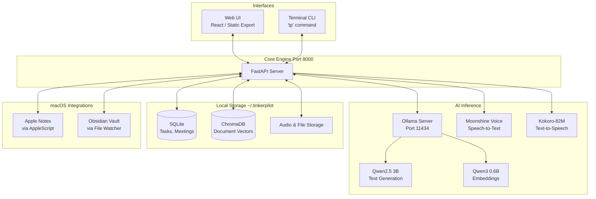

TinkerPilot is designed as a standalone, offline-first application. When installed globally, it runs as a single lightweight FastAPI server that mounts the static Next.js frontend, entirely eliminating the need for Node.js at runtime.

### Technical Stack & Decisions

*   **Frontend:** Next.js (React) configured for `output: export`. Compiles to static HTML/JS for zero-dependency hosting.
*   **Backend:** Python FastAPI. Fast, modern, and perfectly suited for streaming AI chunks via WebSockets.
*   **Local AI:** Ollama running the Qwen family. Hand-selected for having the best performance-to-size ratio on consumer hardware (Apple Metal GPU on macOS, CPU/CUDA on Linux).
*   **Audio AI:** Moonshine Voice (STT) and Kokoro (TTS) running natively via PyTorch. Avoids heavy C++ compilation steps while maintaining real-time streaming latency.
*   **Data Storage:** SQLite (structured data) and ChromaDB (vector embeddings). No background database daemons required.

All inference runs locally via Ollama with hardware-appropriate acceleration (Metal on macOS, CUDA on Linux with NVIDIA GPU, CPU otherwise). See [Model Selection](./model-selection.md) for detailed model justification.
