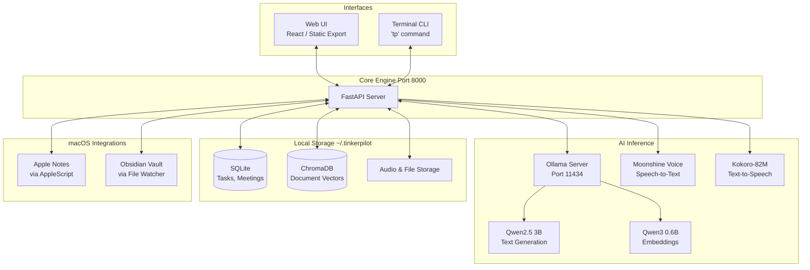
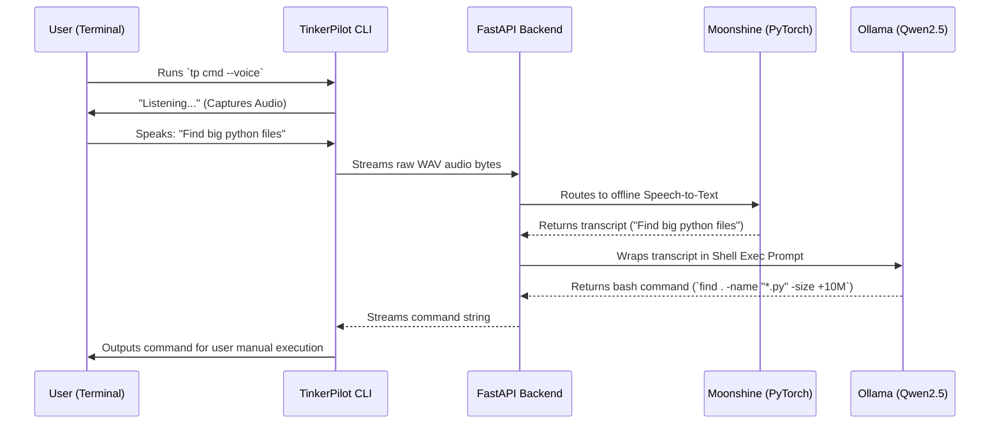

TinkerPilot is designed as a standalone, offline-first application. When installed globally, it runs as a single lightweight FastAPI server that mounts the static Next.js frontend, entirely eliminating the need for Node.js at runtime.

### Technical Stack

*   **Frontend:** It uses Next.js framework. Compiles to static HTML/JS for zero-dependency hosting.
*   **Backend:** It uses Python FastAPI framework. Fast, modern, and perfectly suited for streaming AI chunks via WebSockets.
*   **Local AI:** It uses Ollama running the Qwen family. Hand-selected for having the best performance-to-size ratio on consumer hardware (Apple Metal GPU on macOS, CPU/CUDA on Linux). Ollama have many models and can be easily swapped with any other local LLM server. You can change the model by changing the `model` field in the `~/.tinkerpilot/config.yaml` file. However, you can change only llm used for text generation, code instruct, chat and embeddings. 
*   **Audio AI:** It uses Moonshine Voice (STT) and Kokoro (TTS) running natively via PyTorch. Avoids heavy C++ compilation steps while maintaining real-time streaming latency.
*   **Data Storage:** It uses SQLite (structured data) and ChromaDB (vector embeddings). No background database daemons required.

All inference runs locally via Ollama with hardware-appropriate acceleration (Metal on macOS, CUDA on Linux with NVIDIA GPU, CPU otherwise).

Let's see how one of the feature of TinkerPilot `tp cmd` works, and how it uses the local AI. It is one of the most used features of TinkerPilot, where you can voice prompt the command you want to run by just running `tp cmd --voice`, and it will give you the command to run, otherwise it can also generate command based on natural language prompt.

1. **Audio Capture**: The user runs `tp cmd --voice`. The Python CLI begins capturing microphone input via the `sounddevice` library.
2. **Speech-to-Text (STT)**: The audio stream is handled entirely by the backend using **Moonshine Voice**. The voice WAV bytes are rapidly converted into a text transcript via local PyTorch inference (using Apple MPS or CUDA GPU acceleration).
3. **Command Generation (LLM)**: The translated natural language transcript is wrapped into a strict system prompt tailored for shell command generation, then passed to the **Qwen2.5-3B-Instruct** model running in the local **Ollama** server.
4. **Execution context**: The backend replies with the exact bash command. For safety reasons, the CLI does not automatically execute the subprocess. It outputs the command directly to the terminal for the user to review, copy, and run manually.
